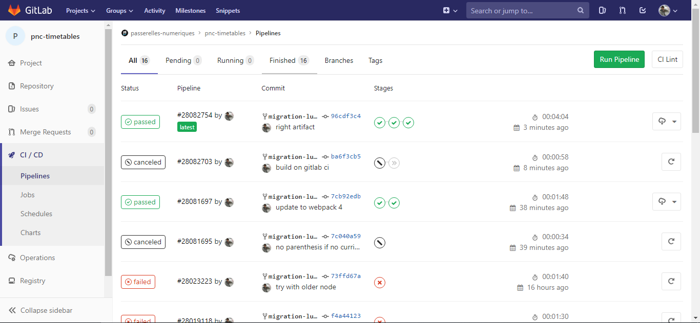
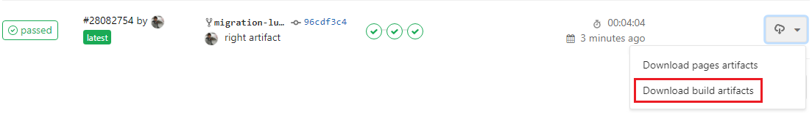
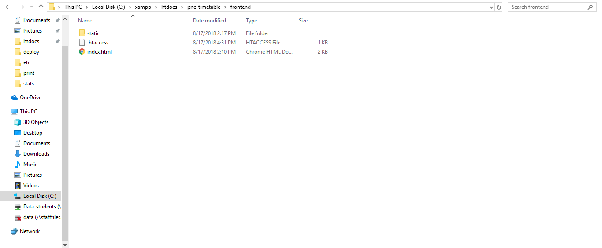

# :desktop_computer: Deployment

> This page explains how to deploy the project.

::: tip
If you just want to know how to use this app, go to [the documentation](/documentation/)
:::

[[toc]]

## Install Front end
> The commands have to be runned in the `frontend` folder

First you have to install the dependencies:
```bash
yarn install
```

### Endpoint
The endpoint has to be updated:

_frontend/config/prod.env.js_
```js {4}
'use strict';
module.exports = {
  NODE_ENV: '"production"',
  BACKEND_ENDPOINT: 'http://localhost/pnc-timetables/backend/public/api/v1'
};
```

### Build the application
To build the application run:
```bash
yarn build
```
The result is in the `dist` folder.

### Using the pipeline
Instead of building the application, you can use the build created by [gitlab pipeline](https://gitlab.com/passerelles-numeriques/pnc-timetables/pipelines)


:::warning
`BACKEND_ENDPOINT` have to be right setted in the `frontend/config/prod.env.js`
:::

## Database

The application uses json file as a datatbase. Deploying the backend is sufficient to have access to the data.

## Deploy application

you can now deploy the `frontend/dist` folder and the `backend` folder


## Deploy example with xampp
First I've created a folder `pnc-timetable` on `htdoc`. I have 2 other folder inside:
- `backend`: it will have the backend folder from our project

- `frontend`: it will have the frontend folder from our project

> notice: I have a .htaccess file in the frontend folder
### Update dns
My `httpd-vhosts.conf` look like this:
```xml
<VirtualHost pnc-timetable.pnc.lan:80>
  ServerName pnc-timetable.pnc.lan
  DocumentRoot "C:/xampp/htdocs/pnc-timetable/frontend"
  ErrorLog "C:/xampp/log/pnc-timetable.pnc.lan-error.log"
  CustomLog "C:/xampp/log/pnc-timetable.pnc.lan-access.log" common
  <Directory "C:/xampp/htdocs/pnc-timetable/frontend/">
    Options +Indexes +Includes +FollowSymLinks +MultiViews
    AllowOverride All
    Require all granted
  </Directory>
</VirtualHost>
<VirtualHost pnc-timetable-backend.pnc.lan:80>
  ServerName pnc-timetable-backend.pnc.lan
  DocumentRoot "C:/xampp/htdocs/pnc-timetable/backend"
  ErrorLog "C:/xampp/log/pnc-timetable-backend.pnc.lan-error.log"
  CustomLog "C:/xampp/log/pnc-timetable-backend.pnc.lan-access.log" common
  <Directory "C:/xampp/htdocs/pnc-timetable/backend/">
    Options +Indexes +Includes +FollowSymLinks +MultiViews
    AllowOverride All
    Require all granted
  </Directory>
</VirtualHost>
```
### frontend htaccess
In order to make the frontend works, I've added a .htaccess:
```htaccess
RewriteEngine On
RewriteBase /
RewriteRule ^index\.html$ - [L]
RewriteCond %{REQUEST_FILENAME} !-f
RewriteCond %{REQUEST_FILENAME} !-d
RewriteRule . /index.html [L]
```
