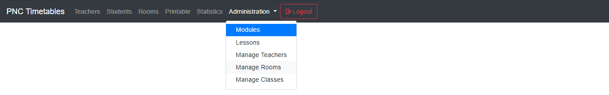
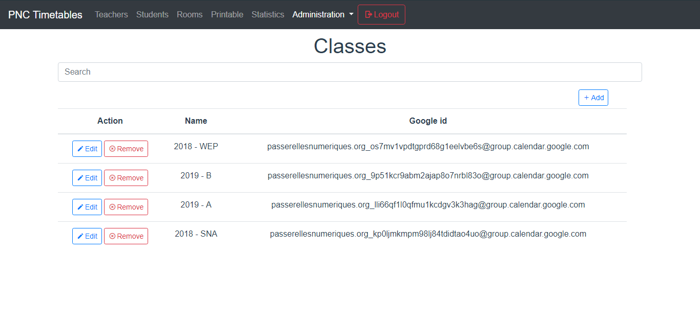
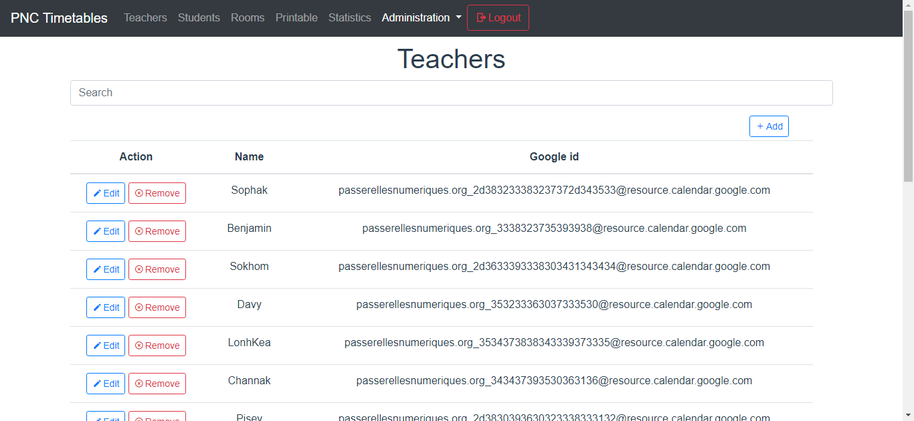
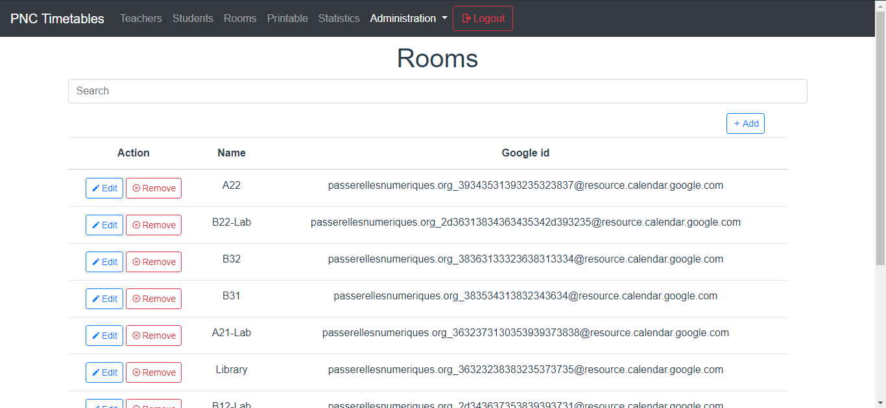
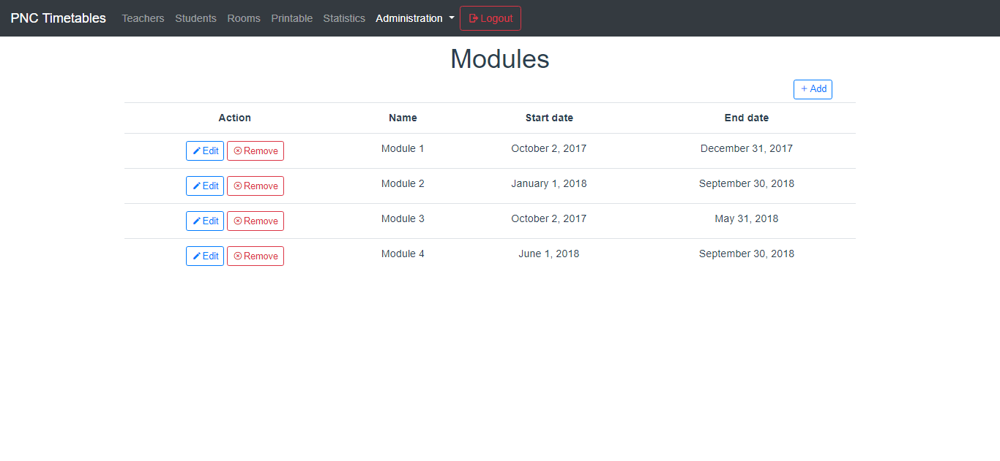
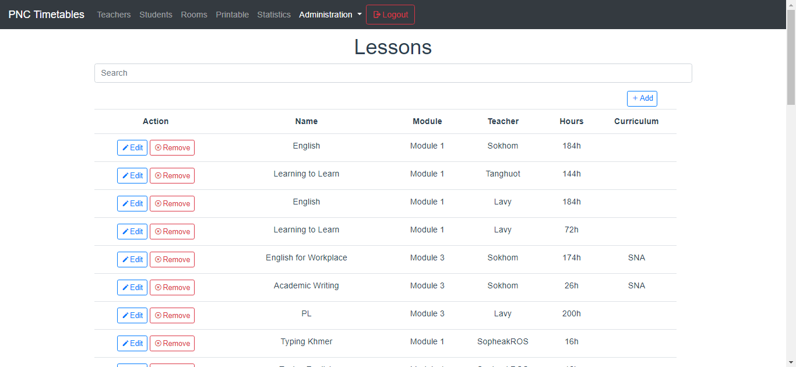

# :pencil: Administration

> The administration tab is used to manage all the data of the application

::: tip Important
You have to be logged to access to the administrator tab
:::
[[toc]]

Class, teacher and room management work the same way.
## Classes

Here you can manage classes. Each class has a name and a google id. Google id is the url used to retrieve event from the google calendar of the class. You can add, edit and remove a class.
| Value     | Explaination                                |
| :-------: | ------------------------------------------- |
| name      | Defines the name of the class               |
| google id | Url used to retrieve google calendar events |
The search bar is used to search a class
## Teachers

Here you can manage teachers. Each teacher has a name and a google id. Google id is the url used to retrieve event from the google calendar of the teacher. You can add, edit and remove a teacher.
| Value     | Explaination                                |
| :-------: | ------------------------------------------- |
| name      | Defines the name of the teacher             |
| google id | Url used to retrieve google calendar events |
The search bar is used to search a teacher
## Rooms

Here you can manage rooms. Each rooms has a name and a google id. Google id is the url used to retrieve event from the google calendar of the rooms. You can add, edit and remove a rooms.
| Value     | Explaination                                |
| :-------: | ------------------------------------------- |
| name      | Defines the name of the room                |
| google id | Url used to retrieve google calendar events |
The search bar is used to search a room
## Modules

Here you can manage module. A module has a name and two dates: a date for the start of the module and another one for the end of the module. You can add, edit and remove a module.
::: warning Important
You cannot remove a module which is used by a lesson
:::
| Value      | Explaination                   |
| :--------: | ------------------------------ |
| name       | Defines the name of the module |
| start date | The beginning of the module    |
| end date   | The end of the module          |
> The modules are not linked to google calendar, you have to update the date of modules every year.
::: tip Info
Modules are used for the statistics about lessons. It is used to get the range of search for the lessons.
:::
The search bar is used to search a module
## Lesson

Here you can manage lessons. A lesson can be added, edited or deleted.
The search bar is used to search a lesson
class attribute :
| Value      | Explaination                                                                         |
| :--------: | ------------------------------------------------------------------------------------ |
| name       | Defines the name of the class                                                        |
| module     | The module of the lesson. It is used to know the date of the lesson (for statistics) |
| teacher    | The teacher who teaches the lesson. It is used to get the google calendar            |
| hours      | Number of hours for the lesson                                                       |
| curriculum | Curriculum of the lesson                                                             |

::: warning Important
The lessons are not linked to google calendar, you have to update them manually
:::
