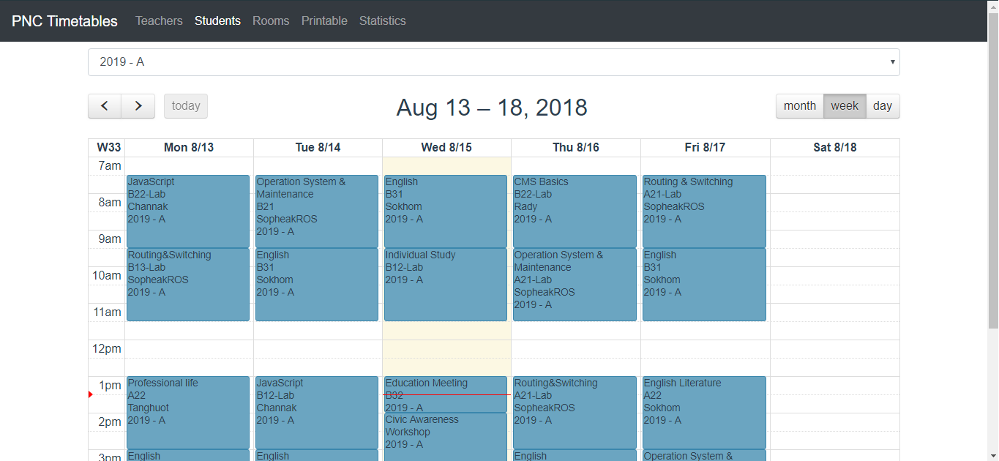
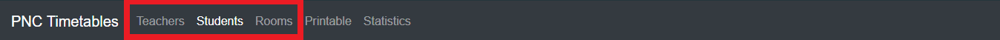
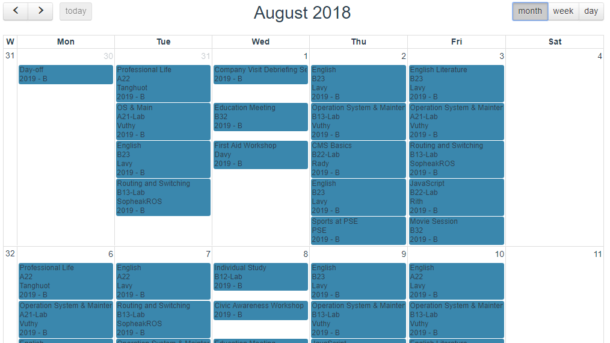
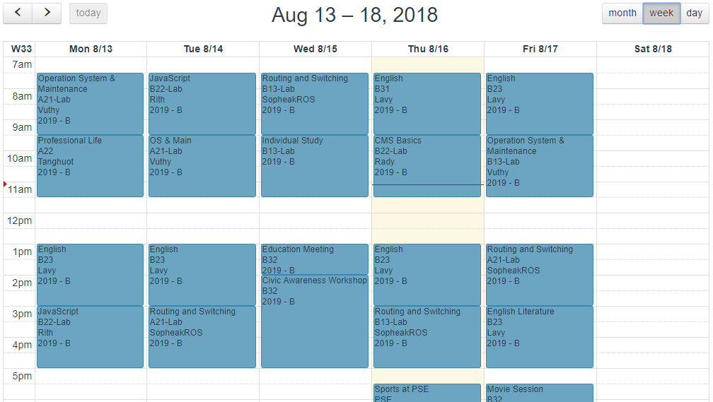
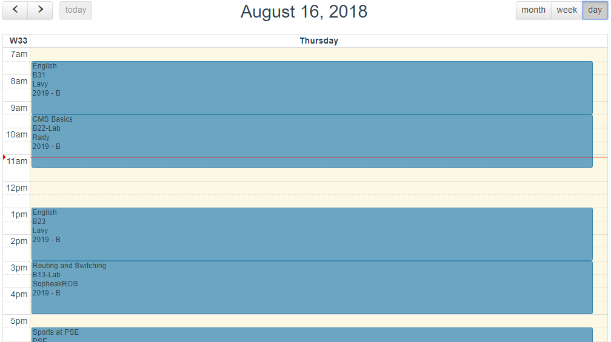

# :date: Calendar

> The first part of the pnc timetable application is the calendar view.

## Overview
With it, you can view the calendar of a class, a teacher or a room.
The events are retrieved from google calendar

> Overview of the calendar

It can be accessed by the top navgation:

The dropdown is used to select the ressource(room, teacher, class) you want. When you have chosen a ressource, the calendar is loaded. You can then navigate on the calendar and see today events.

## Calendar views
They are three different views for those calendars:
- month view

- week view

- day list view

