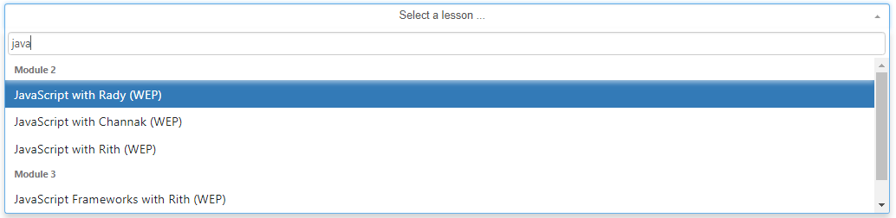
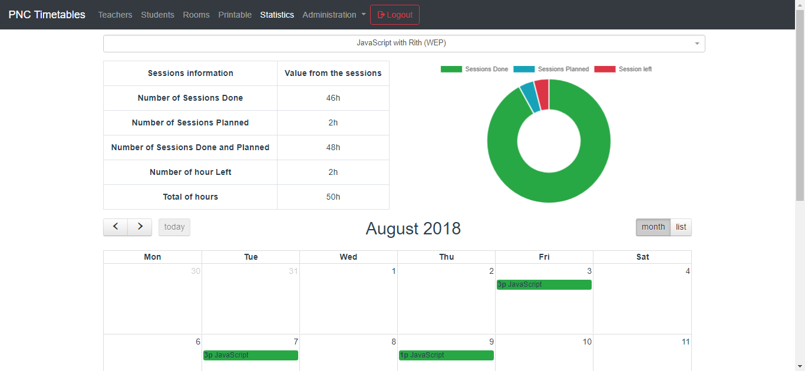
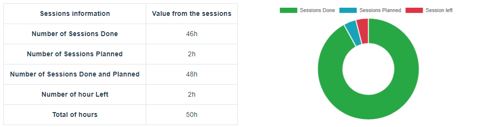
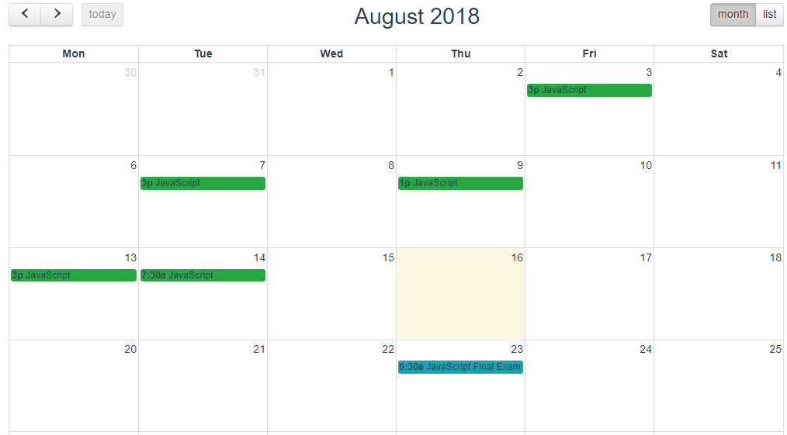
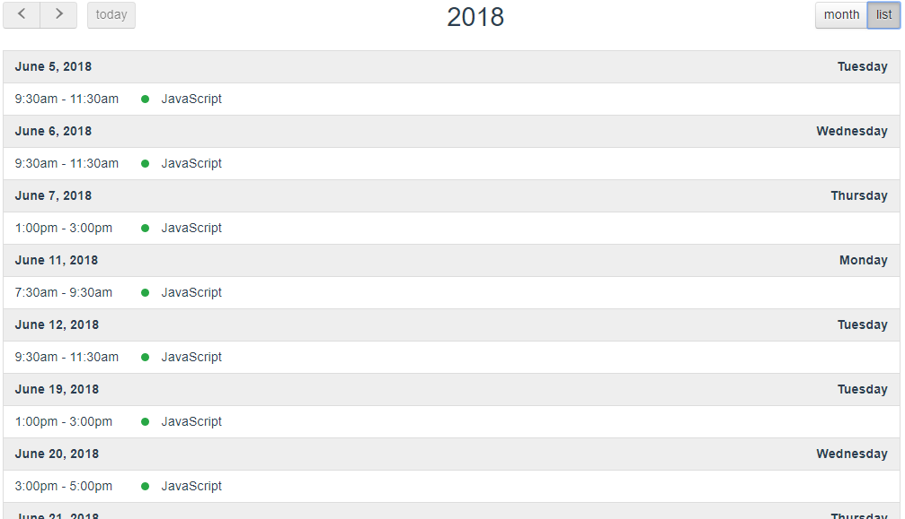

# :bar_chart: Lesson statistics

> The part is used to get information about the lessons.

## Selection
First you have to choose a lesson. You can do it by using the dropdown. It has a search bar on it.

When a lesson is choosed, information about the lesson appears.

## Lesson Data
You have a table, on the left which desribed the number of lesson done, planned and left. You also have the total of lesson to do and the total of lessons done and planned.

On the right, a doughnut graphic sums up the table, so you can have a visual information about the lesson. The lessons done are in green, the lessons planned in blue and the lessons left in red.

## Calendar
Finally, a calendar shows all the lessons from the google calendar. The lessons in green are done and the lessons in blue are planned

> You can also see the lesson as a list

